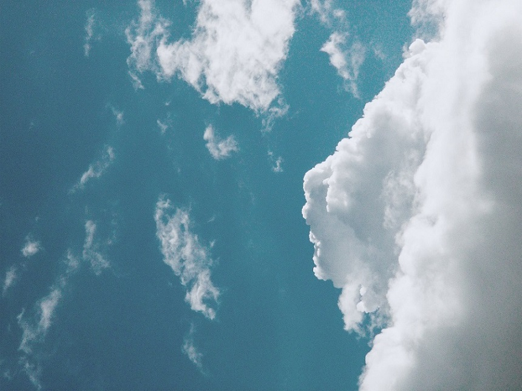
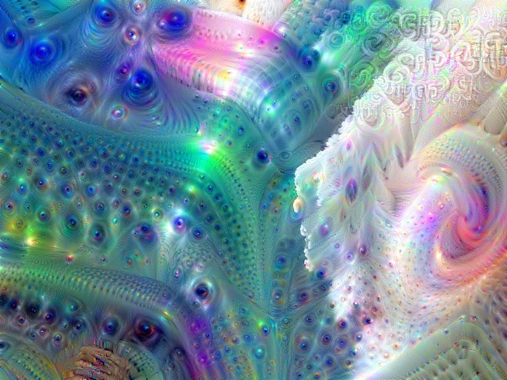
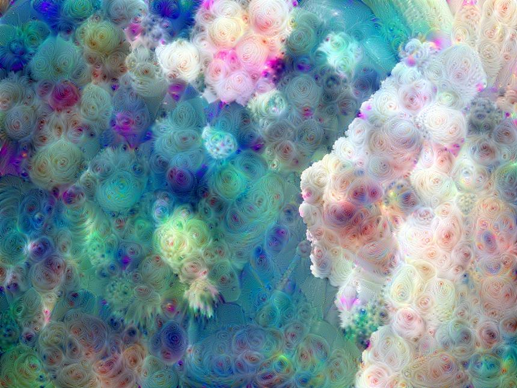
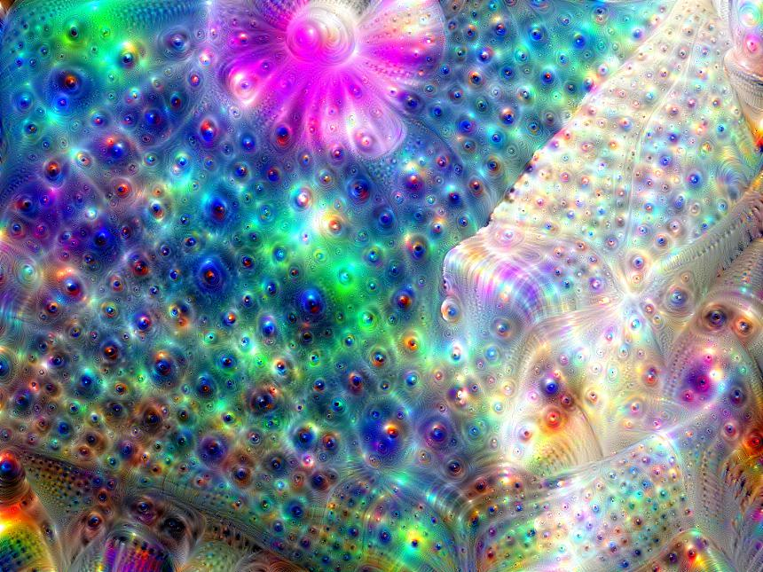
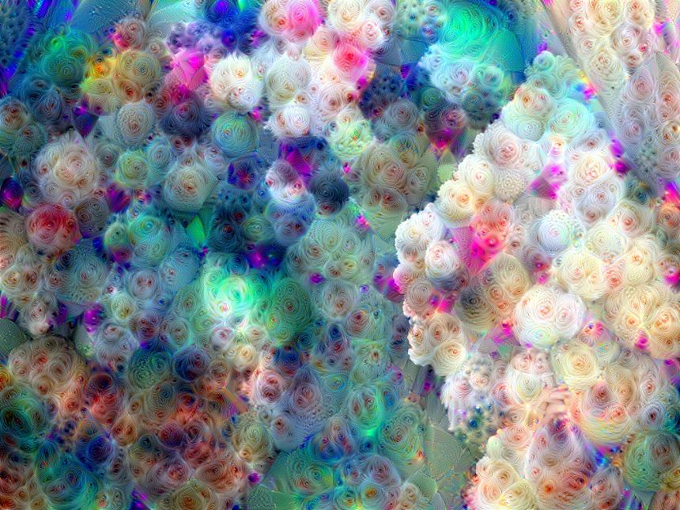

#### Deep Dream
##### Outline:
1. What`s the meaning of "Deep Dream"?
2. Some Tricks.
3. Laplace pyramid sampling and Gaussian filter.
4. Training with or without guiding image.
##### Demo:
1. Training Image (as background):   

2. Guiding Image:  

3. Just multi-scale images without guiding:

4. Multi-scale images with guiding:

3. Laplace pyramid sampling without guiding:

4. Laplace pyramid sampling with guiding:

##### Ref:
[Deep Dream](https://ai.googleblog.com/2015/06/inceptionism-going-deeper-into-neural.html)  
[Google Implementation](https://tensorflow.google.com/tutorials/generative/deepdream)   
[PyTorch-Deep-Dream](https://github.com/eriklindernoren/PyTorch-Deep-Dream)  
[DeepDream](https://github.com/CharlesPikachu/DeepDream)  
[Deep_Dream](https://blog.csdn.net/gangzhucoll/article/details/83145927)  